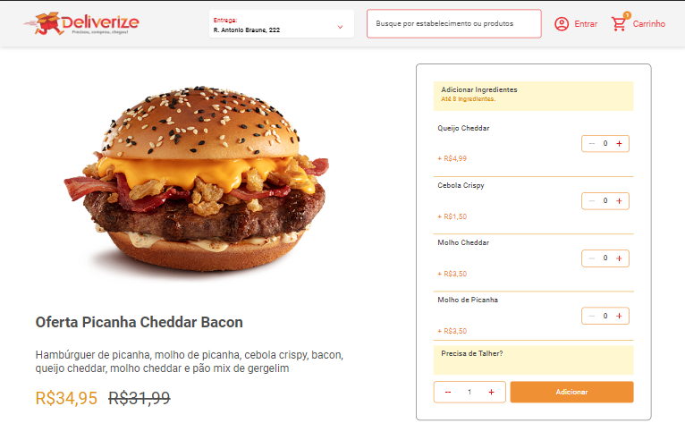

<h1 align="center">Deliverize</h1>

## 🔖Preview
<p>
	
	
</p>
  
## 📜 Sobre
<p>
	Teste para a vaga de FrontEnd da TeamSoft.
</p>

[Clique aqui para ver a aplicação na Web](https://deliverize.netlify.app/)


## 🚀 Tecnologias
### Frontend:
- React
- Styled Components
- TypeScript
- Redux
- Axios
- React Icons
- Vite Js

## 💻 Iniciando o Projeto Localmente


### Requisitos

**Clone o Projeto e acesse o Diretório**

```bash
$ git clone https://github.com/andreydantasvf/Deliverize && cd Deliverize
```

**Para iniciar a aplicação web:**
```bash
$ npm install
```
```bash
$ npm run dev
```